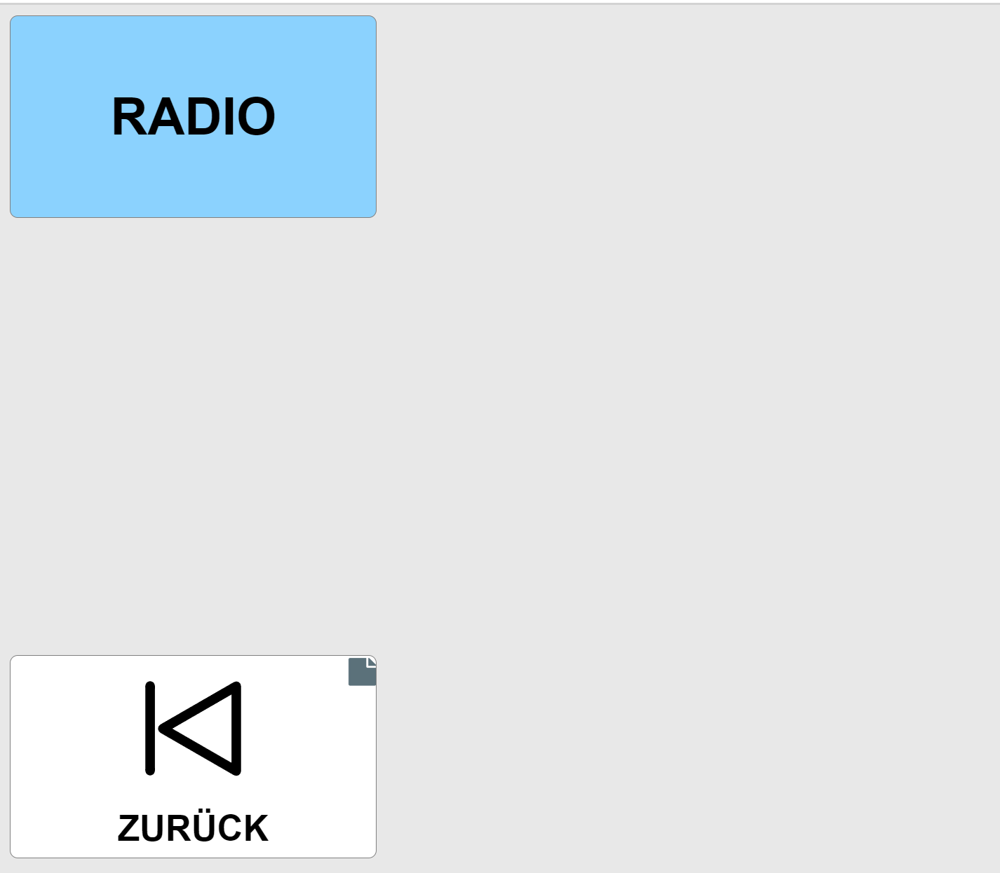

# ATLAB-ABGABE-SANDRA
ATLAB Umgebungssteuerung für 2. Antritt
Use-Case Klientin Sandra: Jan Matousek

## Vorhandene Funktionen
Sandra kann beim linken Arm den Daumen und Zeigefinger bewegen sowie einfache Kopfbewegungen durchführen, außerdem kann sie ihre Sprache weiterhin verwenden.

## Umgesetzte Funktionen
1. Umgebungssteuerung über Sprachbefehle (Licht (Asterics Grid, openHAB, ACS), Jalousien (openHAB, ACS), Temperatur (ACS)

2. Internetradio (Asterics Grid)

## Verwendete Programme/Komponenten
Microsoft Spracherkennung, Asterics Runtime Environment (ARE), Asterics Configuration Suite (ACS), Asterics Grid und openHAB.
Die Steuerung von Licht Jalousien und dem Internetradio wird mit openHAB verknüpft (ARE ACS und localhost:8080)

### Spracherkennung (Microsoft) 

Da die Patientin motorisch beeinträchtigt ist wird der mit der Microsoft Spracherkennung verwendet um die Maus und Tastatur zu ersetzen. (Befehle Windows Spracherkennung: https://support.microsoft.com/de-de/windows/befehle-der-windows-spracherkennung-9d25ef36-994d-f367-a81a-a326160128c7) 
Der Befehl "Maus klicken" lässt blendet ein durchnummeriertes Raster mit den Zahlen von 1-9 ein, um den Auswahlbereich einzugrenzen muss man eine Zahl nennen danach wird das Raster kleiner es muss mindestens 3 mal der Bereich eingegrenzt werden um einen Mausklick mit "<Nummer> klicken" durchzuführen.  (siehe Video).

### AsTeRICs Grid
AsTeRICs Grid wird für die Umsetzung der Lichtsteuerung und das Aufrufen eines Internetradios für MusikverwendetFür die Umsetzung einer Umgebungssteuerung wird mittels openHAB ein zentraler Server verwendet der es erlaubt die Anwendungen ACS und ARE zu verbinden und in den Grid als auszuführende Aktion einzubinden. Durch das Einbinden eines ACS Modelles können AsTeRICs Aktionen durchgeführt und in openHAB visualisiert werden.
Layout des Hauptgrids, In AsTeRICS Grid können Zellen angelegt werden,

Dabei kann der Text frei gewählt werden und auch ein Bild zur Unterstützten Kommunikation herangezogen werden hier ein Beispiel für die Lichtsteuerung:

Beim Anklicken der Zelle wird nicht nur das Label z.B. AN ausgesprochen sondern auch eine AsTeRICS Aktion durchgeführt da hier das ACS Demo Modell übergeben wird

kann ein String an openHAB über den String Dispatcher gesendet werden für diesen Fall Item Light_GF_Kitchen_Ceiling ON oder für AUS Item Light_GF_Kitchen_Ceiling OFF.
In den 2 folgenden Abbildungen wird die Zelle für das Internetradio als Web-Radio Aktion dargestellt.

### openHAB ( open Home Automation Bus)
Mit openHAB werden AsTeRICs Programme verknüpft mit dem Ziel der vereinfachten Automatisierung im Smart Home Bereich oder in diesem Fall als barrierefreie Unterstützung für Menschen mit Beeinträchtigungen. OpenHAB dient auch als lokaler Server für die AsTeRICS Anwendungen und wird so gestartet:

Dann kann die Seite http://localhost:8080/ geöffnet werden.

und die Sitemap Demo http://localhost:8080/basicui/app?w=GF_Kitchen&sitemap=demo aufgerufen werden die für die Visualisierung der Funktion Licht An/Aus, Jalousien Hoch/Runter und Temperaturwert anzeigen benötigt wird.

### ACS (AsTeRICs Configuration Suite)
Bei der ACS werden Elemente eines GUI in vorgefertigten Programmblöcken programmiert, diese sind in die Kategorien Sensors, Processors and Actuators unterteilt. Durch das Verknüpfen mit der ARE kann das erstellte Modell (siehe Nachtrag ACS) nutzbar gemacht und ausgeführt werden. Im GUI Editor lässt sich die Anordnung der zur Verfügung stehenden Elemente verändern. 

ACS lässt sich mit der ARE verbinden dazu muss die Anwendung ebenfalls gestartet werden und der lokale openHAB Server gestartet worden sein. Wenn das Modell fertig ist kann dieses über "Upload Model" auf die ARE übertragen und ausgeführt werden, es kann aber auch ein sich in der ARE befindende Modell lokal abgesichert werden mit "Download Model".

Hier lassen sich die verschiedenen Elemente beliebig anordnen.

openHAB Processor mit 3 Items: Temperatur, Licht und Jalousien

Button Grid für die 3 Items

### ARE (AsTeRICs Runtime Environment)
Das in ACS erstellte Modell wird in die ARE hochgeladen und kann dann gestartet werden wodurch sich dann ein interaktives GUI öffnet. 

Ausgeführtes ACS Modell in der ARE
### ACS Properties für Temperatur Slider

## Nachtrag ACS
Hier ist das vollständige ACS Modell abgebildet.

## Video Doku siehe main
## Nachtrag Sehschwäche
Für Sandras Protanopie wird in den Windows-Einstellungen ein passender Farbfilter eingestellt und bei dem AsTeRICS Grid darauf geachtet kein Rotton zu verwenden.

